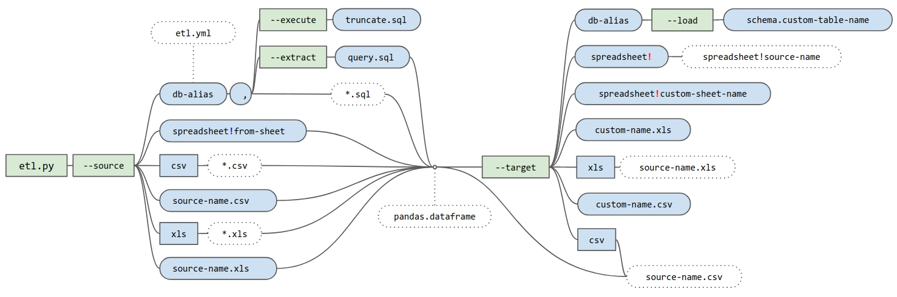

### Installation:
    sudo apt install python3-dev python3-pip
    sudo -H pip3 install git+https://github.com/ankiano/etl.git -U

### Examples of usage:

    etl --help

    etl --source dbname --extract my-query.sql --target some-gsheet-workbook!my-sheet
    etl --source db1,db2 --extract cube.sql --target xls
    etl --source some.csv --target some-new.xls
    etl --source db1 --extract my-query.sql --target db2 --load scema.table_my_query
    etl --source db1 --extract my-query-template.sql --target csv --user_sql_parameter 123

### Options syntax scheme:


### Configurating:

Config `.etl.yml` searching priorities:

1. by command option `--config /somepath/.etl.yml`
2. by os enviroment variable "ETL_CONFIG" ```sudo echo "export ETL_CONFIG=~/etl.yml" > /etc/profile.d/etl-config.sh```
3. by default in home directory
4. if nothing found, then will be created default config with some examples

Google api token `.google-api-key.json` searching priorities:
1. by command option `--google-api-key /somepath/.custom-key-name.json`
2. by command option `--google-api-key key-alias`, from config file `.etl.yml` in block `google_api_keys:`
3. by os enviroment variable "GOOGLE_API_KEY" ```sudo echo "export GOOGLE_API_KEY=~/.custom-key-name.json" > /etc/profile.d/google-api-key.sh```
4. by config file `.etl.yml` in block `google_api_keys: key-alias: "/somepath/.custom-key-name.json"`, if more than one key is specified, then the key will be selected randomly
5. by default in home directory with preset file name `.google_api_key.json'

### Hive dependencies:
For conection to hive thrift server you might need install

    sudo apt-get install libsasl2-dev
    sudo -H pip3 install PyHive==0.5.2 thrift==0.10.0 sasl==0.2.1 thrift-sasl==0.3.0

For Windows it's also possible, but with some difficults:
install sasl from wheel https://www.lfd.uci.edu/~gohlke/pythonlibs/#sasl
or
1. Instead `sasl` you might install `pure-sasl`
2. Replace some code in [`pyhive/hive.py`](https://github.com/dropbox/PyHive/pull/122/commits/9662233072f8d64dfca8d4babe0ddf9bac003536)
3. Replace some code in [`thrift_sasl/___init.py___`](https://github.com/cloudera/impyla/issues/238)
